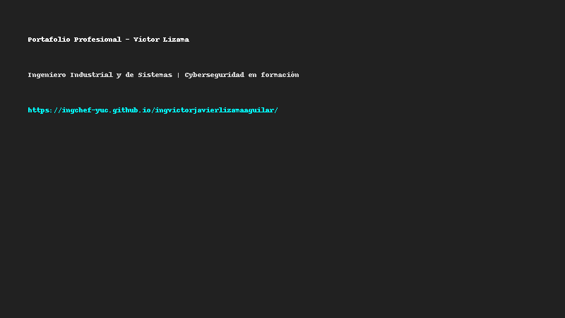

# 👨‍💻 Victor Lizama

> **Ingeniero Industrial y de Sistemas** | Cyberseguridad en formación | Chef en formación | Emprendedor  
> 🧑‍🍳 Padre de familia de día, rockero de noche  
> 📍 Mérida, Yucatán, México

---

## 🌐 Portafolio Profesional

Visita mi sitio web:  
🔗 **[ingchef-yuc.github.io/ingvictorjavierlizamaaguilar](https://ingchef-yuc.github.io/ingvictorjavierlizamaaguilar/)**

---

## 🧠 Sobre mí

Soy un profesional multidisciplinario en constante formación. Actualmente combino mis estudios en **ciberseguridad** con mi experiencia como ingeniero y mi pasión por la cocina. Este portafolio es una muestra de mi perfil técnico y personal.

---

## 🛠️ Tecnologías

---

## 📫 Contacto

- 📧 victorjaviervidaprofesional@gmail.com  
- 💼 [LinkedIn](https://www.linkedin.com/in/ingvictorlizamamx)

---

## 🏁 Estadísticas y actividad

---

## ⚙️ Workflow automático: Última actualización

> Este README se actualiza automáticamente usando GitHub Actions para reflejar actividad y progreso técnico.

---

## 📌 Notas futuras

Este proyecto está en evolución. Próximamente agregaré:

- Proyectos destacados en GitHub  
- Blog técnico sobre ciberseguridad y cocina (¡por qué no!)  
- Mejoras visuales y responsive en el portafolio

---

Gracias por visitar mi perfil 🙌  
¡Estoy siempre abierto a colaborar y aprender más!

---

> _Este README fue generado con ayuda de IA y personalizado para representar fielmente mi identidad profesional._

